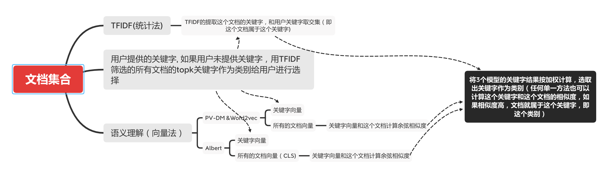

# NLP

## 主要使用tfidf+doc2vec+albert实现无监督文本分类, 代码有些粗鄙，有些问题已经在代码中标注，我会逐渐修改完善，欢迎任何意见和建议！
实际测试准确率不高，还是需要结合人工制定规则+有监督训练，在结合部分无监督训练可能有更好效果

### 无监督分类算法，使用tfidf， doc2vec， albert

### python文件
unsuper_classification.py

## TextCNN 通用文本分类模型
TextCNN文件夹
注意：数据目录下的每个文件夹放好对应的要训练的目录，目录里面放好单个文件就可以
/data/train/

## Res2Net 通用图片分类模型
Res2Net文件夹
