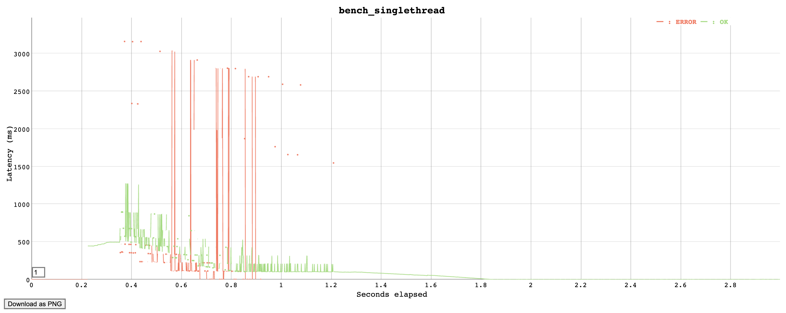
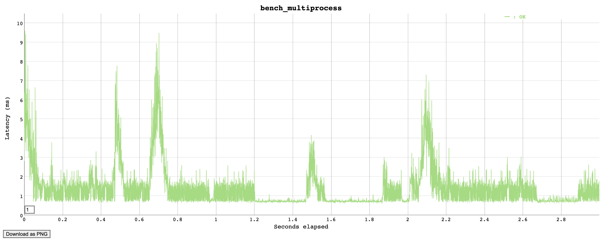
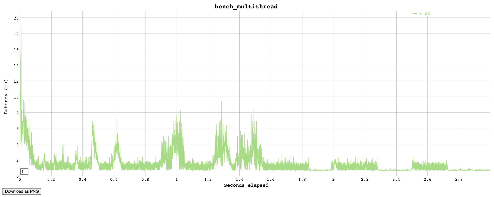
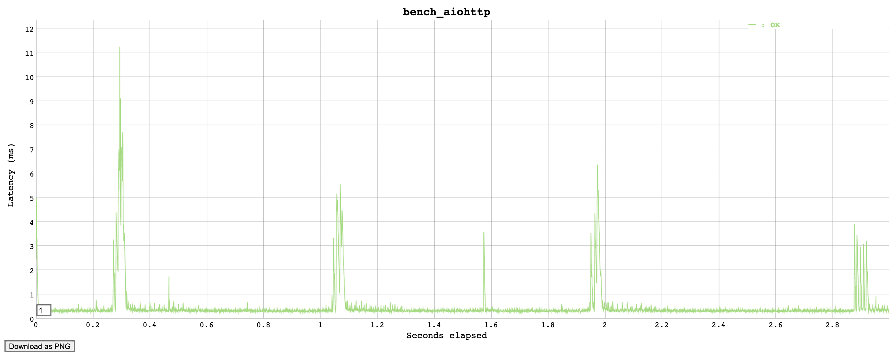

# API

#### Flask 版本介绍
- flask_api_server.py 是Flask的版本
- 可以使用gunicorn_flask_api_server.sh启动
- 使用test_flask_api_server.py进行单元测试

### 异步版本aiohttp
- aiohttp_api_server.py 是基于aiohttp的异步版本
- 使用test_aiohttp_api_server.sh测试


### 压力测试Benchmark
* 使用的工具是: Vegeta, Star是14.8， https://github.com/tsenart/vegeta
* 当前环境：Mac OS i5, 1.4GHZ, 16GB, SSD

* 测试脚本， 自动测试多进程，多线程，和异步的serverd的对比结果，结果保存为2种形式，分别为html图片格式，和txt文本格式
`benchmark.sh`


#### 对比结果
以下是每秒请求2000次，测试3秒的结果对比, 根据每个人的电脑或服务器的性能不同，结果也不同，这是一个相对的结果
- 单线程每秒超过1000次请求时，已经无力，超2000时已经超时

- 多核，4core 对比

- 多线程，单核10thread 对比

- aiohttp异步对比


- 异步的延迟 rate 2000/s, 成功率100%
```
Latencies     [min, mean, 50, 90, 95, 99, max]  290.812µs, 414.588µs, 344.785µs, 481.47µs, 591.848µs, 2.359ms, 5.04ms
```
- 多线程的延迟 rate 2000/s， 成功率 75.38%
```
Latencies     [min, mean, 50, 90, 95, 99, max]  261.772µs, 4.391s, 799.417ms, 28.908s, 30s, 30.001s, 30.005s
```

### 当增加请求频率到2500/s时，CPU出现瓶颈，
- 异步的成功率在31.06%
```
Latencies     [min, mean, 50, 90, 95, 99, max]  5.224ms, 13.68s, 8.096s, 30s, 30.001s, 30.002s, 30.005s
Success       [ratio]                           31.06%
```
- 多线程的成功率在16.26%
```
Latencies     [min, mean, 50, 90, 95, 99, max]  13.181ms, 26.705s, 30s, 30.001s, 30.001s, 30.003s, 30.006s
Success       [ratio]                           16.26%
```
